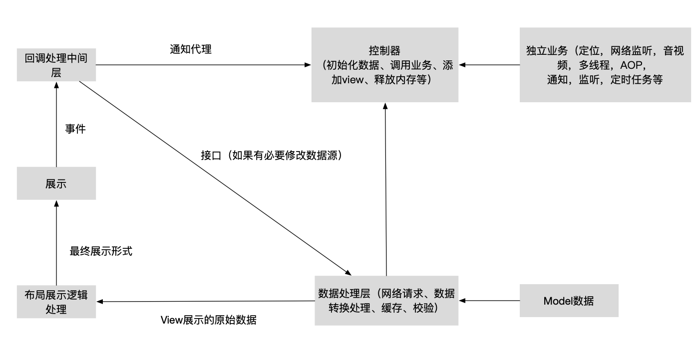

# Swift demo工程
## usage：
1. pod install ，
2. open workspace
  
## 说明
* 请看忽略文件， 比如pods目录是不需要提交的
* 项目目录必须与真实目录一致
* pods包含常用的第三方库
* 每个模块包含数据处理层、视图处理层、控制器层，MVC的优化为了业务解耦

## 多工程联编  
1. 主工程可以调用子工程，反之不行
2. 子工程可以调用别的子工程，但不能互相调用
3. 所有工程都依赖NPBaseKit工程
4. 工程之间调用，可以使用swift和OC类（公开头文件）  

## 限制
1. 子工程framework不支持桥接头文件
2. 子工程不支持扩展属性
3. 子工程中不能使用OC扩展
4.  工程之间不能流畅的玩转runtime和混编

## 关于主题  
采用了第三方库[SwiftThemes](https://github.com/wxxsw/SwiftTheme) ，同时适配暗黑模式  
1. 当业务对主题需求不大，仅适配暗黑模式，可以使用Index Mode  
2. 为了业务扩展，这里采用了Json mode，不仅支持暗黑模式，还支持多种主题切换，目前只使用了Normal_theme

## Unit Test
**说明：**

* 单元测试用来进行正确性检验的测试工作
* 尽量避免耦合，将工程和代码分解成多个小部件，从而更易于测试
* 使用的是iOS原生测试框架XCTest  
* 这里使用的是多工程，子工程的方法需要使用模拟器测试。  
[XCTest](https://developer.apple.com/documentation/xctest)官方文档学习